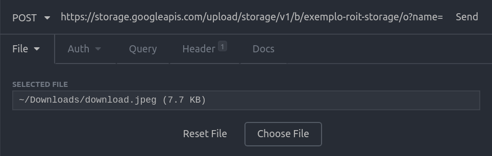

# ROIT Storage

### Usage for Google Cloud Storage

In the `env.yaml` file add the `googleStorageCredential{}` attribute, with the number of folders inside the {}:

```yaml
dev:
    googleStorageCredential{5}: my-credential.json
```

Inject in your desired class:
```typescript
import { GoogleCloudHandler } from '@roit/roit-storage'

constructor( 
    private readonly googleCloudHandler: GoogleCloudHandler
) {}
```

To use the `retrieveFromStorage` method:
```typescript
const filePath = 'path/from/my/file'
const bucketName = 'my-files-bucket'

const url = await this.googleCloudHandler.retrieveFromStorage(filePath, bucketName)
console.log(url) // outputs https://storage.googleapis.com/...
```

To use the `getSignedUrl` method:
```typescript
const filePath = 'path/from/my/file'
const bucketName = 'my-files-bucket'

const url = await this.googleCloudHandler.getSignedUrl(filePath, bucketName)
console.log(url) 
```

The `getSignedUrl` method returns a URL from Google that you need to perform a HTTP POST with the binary encoded file you want to upload, here is a example in Insomnia:



### Nestjs Usage

In Nestjs, don't forget to add the `GoogleCloudHandler` on the `AppModule` as a provider:
```typescript
@Module({
  imports: [],
  controllers: [],
  providers: [
    GoogleCloudHandler
  ],
})
export class AppModule { }
```
